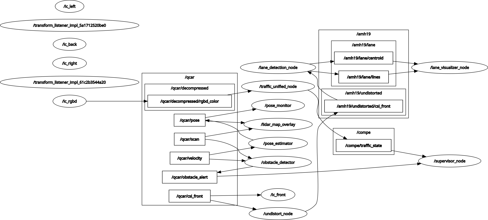

# sudo_drive 

ROS2-based autonomous navigation stack for QCar1 — 8th semester project by the **SUDO DRIVE** team at Tecnológico de Monterrey, Puebla Campus.

---

## What this does

Full autonomous driving pipeline for the Quanser QCar1 platform, including:

- Yellow line detection and lane tracking using the Sliding Windows method
- Pure Pursuit controller for smooth path following
- LiDAR-based mapping and obstacle awareness
- Supervisor node to coordinate the full navigation stack
- CSI camera calibration utilities

---

## Repo structure

```
sudo_drive/
├── qcar_calibration/       # CSI camera calibration scripts
├── src/qcar_navigation/    # Main ROS2 packages
│   ├── lane_detection/     # Sliding window + HSV masking
│   ├── pure_pursuit/       # Pure Pursuit controller node
│   └── supervisor/         # Mission supervisor node
├── trayectoria/            # Trajectory definitions and map overlays
├── map.jpg                 # LiDAR map of the track
└── rosgraph-sudo.png       # ROS2 node graph
```

---

## Requirements

- ROS2 Humble (or Foxy)
- Python 3.8+
- OpenCV (`cv2`)
- NumPy
- Quanser QCar1 hardware + ROS2 drivers

---

## Setup

```bash
# Clone the repo
git clone https://github.com/abrahammorohdez19/sudo_drive.git
cd sudo_drive

# Build the workspace
colcon build
source install/setup.bash
```

---

## Running the stack

```bash
# Launch full navigation stack
ros2 launch qcar_navigation sudo_drive.launch.py

# Lane detection only (testing)
ros2 run qcar_navigation lane_detection

# Pure Pursuit controller only
ros2 run qcar_navigation pure_pursuit
```

---

## Key design decisions

**Lane detection** — Sliding Windows on a binarized HSV mask tuned for yellow lines. ROI restricted to the lower half of the frame to reduce noise. Illumination issues with natural light were solved by tightening the HSV range and adding exposure control on the CSI camera.

**Pure Pursuit** — The nearest window centroid is used as the lookahead point. Velocity is reduced dynamically when entering curves to compensate for the vehicle's inertia. A default left-turn command is triggered when the line is lost.

**Supervisor** — Coordinates state transitions between lane following, curve handling, and stop conditions.

---

## ROS2 node graph



---

## Team

SUDO DRIVE — Tecnológico de Monterrey, Campus Puebla · 8th semester · 2026
